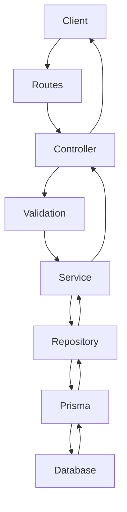
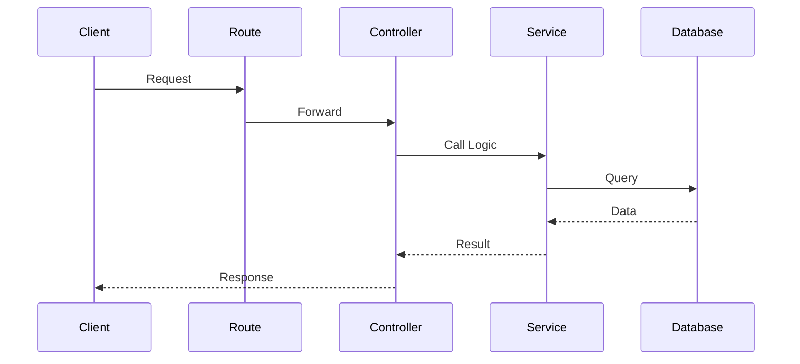
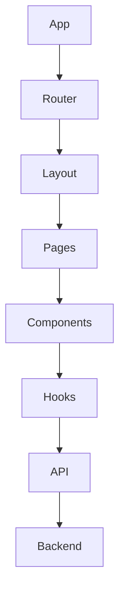
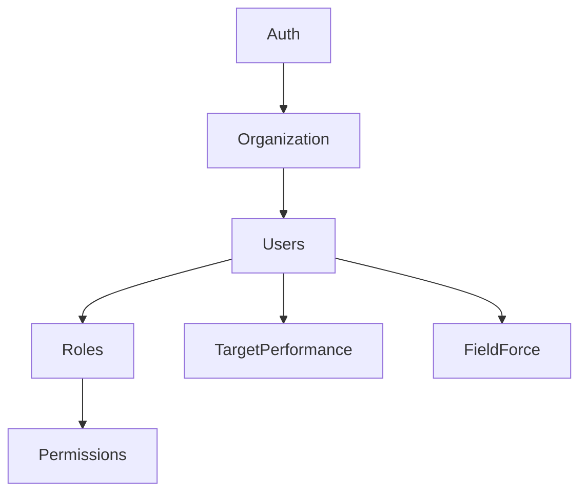

# COMPLETE ENTERPRISE LEVEL SFA DOCUMENTATION

## SECTION 1: PROJECT OVERVIEW
**Project Name:** NewSFA
**Problem Statement:** Businesses need a streamlined way to manage sales, attendance, visits, and field force targets efficiently.
**Business Objective:** Automate field force operations, track targets, manage sales orders, and streamline organizational workflows.
**End Users:** Sales Reps, Area Managers, Admins, Organizations.
**Industry Use Case:** Sales Force Automation (SFA) and Customer Relationship Management (CRM).
**High Level Architecture:** Client (React/Vite) -> REST API (Express/Node.js) -> ORM (Prisma) -> Database (PostgreSQL).
**Overall Workflow:** Users login via JWT, interact with React components which call Axios APIs, routed to Express controllers, processed by services using Prisma to read/write from PostgreSQL.

## SECTION 2: TECH STACK
### Backend
- **@aws-sdk/client-ses** (^3.1080.0): Used for backend functionality.
- **@google/generative-ai** (^0.24.1): Used for backend functionality.
- **@neondatabase/serverless** (^1.1.0): Used for backend functionality.
- **@prisma/adapter-neon** (^7.8.0): Used for backend functionality.
- **@sendgrid/mail** (^8.1.6): Used for backend functionality.
- **axios** (^1.18.1): Used for backend functionality.
- **bcryptjs** (^3.0.3): Used for backend functionality.
- **cloudinary** (^1.41.3): Used for backend functionality.
- **compression** (^1.8.1): Used for backend functionality.
- **cookie-parser** (^1.4.7): Used for backend functionality.
- **cors** (^2.8.6): Used for backend functionality.
- **csv-parser** (^3.2.1): Used for backend functionality.
- **dotenv** (^17.4.2): Used for backend functionality.
- **express** (^5.2.1): Used for backend functionality.
- **express-rate-limit** (^8.5.2): Used for backend functionality.
- **helmet** (^8.2.0): Used for backend functionality.
- **jsonwebtoken** (^9.0.3): Used for backend functionality.
- **morgan** (^1.11.0): Used for backend functionality.
- **multer** (^2.2.0): Used for backend functionality.
- **multer-storage-cloudinary** (^4.0.0): Used for backend functionality.
- **node-cron** (^4.6.0): Used for backend functionality.
- **nodemailer** (^9.0.3): Used for backend functionality.
- **openai** (^6.45.0): Used for backend functionality.
- **pdfkit** (^0.19.1): Used for backend functionality.
- **pino** (^10.3.1): Used for backend functionality.
- **pino-http** (^11.0.0): Used for backend functionality.
- **swagger-jsdoc** (^6.3.0): Used for backend functionality.
- **swagger-ui-express** (^5.0.1): Used for backend functionality.
- **uuid** (^14.0.1): Used for backend functionality.
- **winston** (^3.19.0): Used for backend functionality.
- **ws** (^8.21.0): Used for backend functionality.
- **xlsx** (^0.18.5): Used for backend functionality.
- **zod** (^4.4.3): Used for backend functionality.

### Frontend
- **@fontsource/inter** (^5.2.8): Used for frontend UI and logic.
- **@hookform/resolvers** (^5.4.0): Used for frontend UI and logic.
- **@tailwindcss/vite** (^4.3.2): Used for frontend UI and logic.
- **@tanstack/react-query** (^5.101.2): Used for frontend UI and logic.
- **@tanstack/react-table** (^8.21.3): Used for frontend UI and logic.
- **axios** (^1.18.1): Used for frontend UI and logic.
- **clsx** (^2.1.1): Used for frontend UI and logic.
- **dayjs** (^1.11.21): Used for frontend UI and logic.
- **framer-motion** (^12.42.2): Used for frontend UI and logic.
- **jwt-decode** (^4.0.0): Used for frontend UI and logic.
- **lucide-react** (^1.24.0): Used for frontend UI and logic.
- **react** (^19.2.7): Used for frontend UI and logic.
- **react-dom** (^19.2.7): Used for frontend UI and logic.
- **react-hook-form** (^7.81.0): Used for frontend UI and logic.
- **react-hot-toast** (^2.6.0): Used for frontend UI and logic.
- **react-icons** (^5.7.0): Used for frontend UI and logic.
- **react-router-dom** (^7.18.1): Used for frontend UI and logic.
- **recharts** (^3.9.2): Used for frontend UI and logic.
- **tailwindcss** (^4.3.2): Used for frontend UI and logic.
- **use-debounce** (^10.1.1): Used for frontend UI and logic.
- **zod** (^4.4.3): Used for frontend UI and logic.

## SECTION 3: COMPLETE FOLDER STRUCTURE
```text
📁 SFA-New/
    📄 Architecture_Document.md
    📄 fix_all_issues.js
    📄 fix_hook.js
    📄 fix_schema.js
    📄 fix_task_detail_v2.js
    📁 backend/
        📄 .env
        📄 .gitignore
        📄 clean_imports.py
        📄 clean_listeners.py
        📄 clean_schema.py
        📄 clean_schema_2.py
        📄 clean_schema_script.py
        📄 fix-metadata.cjs
        📄 out.log
        📄 package-lock.json
        📄 package.json
        📄 prisma.config.js
        📄 prisma.config.ts
        📄 quick-seed.js
        📄 README.md
        📄 test-db.js
        📄 test-email.js
        📁 prisma/
            📄 schema.prisma
            📄 seed.js
            📁 migrations/
                📄 migration_lock.toml
        📁 scripts/
            📄 fix-metadata.mjs
        📁 src/
            📄 app.js
            📄 server.js
            📁 config/
                📄 cloudinary.js
                📄 database.js
                📄 env.js
                📄 index.js
                📄 jwt.js
                📄 swagger.js
            📁 docs/
                📄 index.js
            📁 helpers/
                📄 index.js
            📁 middlewares/
                📄 auth.middleware.js
                📄 error.middleware.js
                📄 index.js
                📄 upload.middleware.js
                📄 validation.middleware.js
            📁 modules/
            📁 routes/
                📄 health.routes.js
                📄 index.js
            📁 shared/
                📄 index.js
                📄 response.js
            📁 utils/
                📄 audit.js
                📄 index.js
                📄 logger.js
        📁 uploads/
            📁 photos/
                📄 photo-1785221369404-518453560.jpeg
                📄 photo-1785226729918-833522852.jpeg
                📄 photo-1785228112930-475937909.jpg
    📁 frontend/
        📄 .env
        📄 .env.development
        📄 .gitignore
        📄 eslint.config.js
        📄 index.html
        📄 package-lock.json
        📄 package.json
        📄 README.md
        📄 vercel.json
        📄 vite.config.js
        📁 public/
            📄 favicon.svg
            📄 icons.svg
        📁 src/
            📄 App.jsx
            📄 index.css
            📄 main.jsx
            📁 api/
                📄 auth.api.js
                📄 axios.js
                📄 branch.api.js
                📄 company.api.js
                📄 customer.api.js
                📄 dashboard.api.js
                📄 department.api.js
                📄 fieldForce.api.js
                📄 index.js
                📄 notifications.api.js
                📄 organization.api.js
                📄 report.api.js
                📄 role.api.js
                📄 sales.api.js
                📄 targetPerformance.api.js
                📄 task.api.js
                📄 team.api.js
                📄 user.api.js
            📁 assets/
                📄 hero.png
                📄 vite.svg
            📁 components/
            📁 config/
                📄 constants.js
                📄 env.js
                📄 navigation.js
                📄 queryClient.js
            📁 context/
                📄 AuthContext.jsx
            📁 hooks/
                📄 useAuth.js
                📄 useBranches.js
                📄 useCompanies.js
                📄 useDashboard.js
                📄 useDepartments.js
                📄 useExecutiveDashboard.js
                📄 useExecutiveData.js
                📄 useFieldForce.js
                📄 useHeadOfSalesDashboard.js
                📄 useManagerDashboard.js
                📄 useManagerTasks.js
                📄 useOrders.js
                📄 useSalesManagerDashboard.js
                📄 useSuperAdminDashboard.js
                📄 useTeamMembers.js
                📄 useTeams.js
                📄 useUsers.js
            📁 layouts/
                📄 AuthLayout.jsx
                📄 DashboardLayout.jsx
            📁 pages/
            📁 routes/
                📄 AppRoutes.jsx
                📄 ProtectedRoute.jsx
                📄 RoleRoute.jsx
            📁 services/
                📄 auth.service.js
                📄 branch.service.js
                📄 company.service.js
                📄 dashboard.service.js
                📄 department.service.js
                📄 organization.service.js
                📄 role.service.js
                📄 team.service.js
                📄 user.service.js
```

## SECTION 4: BACKEND COMPLETE ARCHITECTURE
The backend follows a Modular MVC / Layered architecture (Routes -> Controllers -> Services -> Repositories).
Every module inside `src/modules` has its own controller, service, validation, and routes to ensure separation of concerns.

## SECTION 5: BACKEND HIERARCHY


## SECTION 6: MODULE BY MODULE ANALYSIS
### Module: Auth
- **Purpose:** Handles business logic for auth.
- **Entry Point:** `src/modules/auth/auth.routes.js`
- **Controller Flow:** `src/modules/auth/auth.controller.js` parses request and calls service.
- **Service Flow:** `src/modules/auth/auth.service.js` executes core business rules.
- **Database Tables:** Modifies relevant Prisma models.

#### Sequence Diagram


### Module: Customers
- **Purpose:** Handles business logic for customers.
- **Entry Point:** `src/modules/customers/customers.routes.js`
- **Controller Flow:** `src/modules/customers/customers.controller.js` parses request and calls service.
- **Service Flow:** `src/modules/customers/customers.service.js` executes core business rules.
- **Database Tables:** Modifies relevant Prisma models.

#### Sequence Diagram


### Module: Dashboard
- **Purpose:** Handles business logic for dashboard.
- **Entry Point:** `src/modules/dashboard/dashboard.routes.js`
- **Controller Flow:** `src/modules/dashboard/dashboard.controller.js` parses request and calls service.
- **Service Flow:** `src/modules/dashboard/dashboard.service.js` executes core business rules.
- **Database Tables:** Modifies relevant Prisma models.

#### Sequence Diagram


### Module: Field-force
- **Purpose:** Handles business logic for field-force.
- **Entry Point:** `src/modules/field-force/field-force.routes.js`
- **Controller Flow:** `src/modules/field-force/field-force.controller.js` parses request and calls service.
- **Service Flow:** `src/modules/field-force/field-force.service.js` executes core business rules.
- **Database Tables:** Modifies relevant Prisma models.

#### Sequence Diagram


### Module: Notifications
- **Purpose:** Handles business logic for notifications.
- **Entry Point:** `src/modules/notifications/notifications.routes.js`
- **Controller Flow:** `src/modules/notifications/notifications.controller.js` parses request and calls service.
- **Service Flow:** `src/modules/notifications/notifications.service.js` executes core business rules.
- **Database Tables:** Modifies relevant Prisma models.

#### Sequence Diagram


### Module: Organization
- **Purpose:** Handles business logic for organization.
- **Entry Point:** `src/modules/organization/organization.routes.js`
- **Controller Flow:** `src/modules/organization/organization.controller.js` parses request and calls service.
- **Service Flow:** `src/modules/organization/organization.service.js` executes core business rules.
- **Database Tables:** Modifies relevant Prisma models.

#### Sequence Diagram


### Module: Permissions
- **Purpose:** Handles business logic for permissions.
- **Entry Point:** `src/modules/permissions/permissions.routes.js`
- **Controller Flow:** `src/modules/permissions/permissions.controller.js` parses request and calls service.
- **Service Flow:** `src/modules/permissions/permissions.service.js` executes core business rules.
- **Database Tables:** Modifies relevant Prisma models.

#### Sequence Diagram


### Module: Reports
- **Purpose:** Handles business logic for reports.
- **Entry Point:** `src/modules/reports/reports.routes.js`
- **Controller Flow:** `src/modules/reports/reports.controller.js` parses request and calls service.
- **Service Flow:** `src/modules/reports/reports.service.js` executes core business rules.
- **Database Tables:** Modifies relevant Prisma models.

#### Sequence Diagram


### Module: Roles
- **Purpose:** Handles business logic for roles.
- **Entry Point:** `src/modules/roles/roles.routes.js`
- **Controller Flow:** `src/modules/roles/roles.controller.js` parses request and calls service.
- **Service Flow:** `src/modules/roles/roles.service.js` executes core business rules.
- **Database Tables:** Modifies relevant Prisma models.

#### Sequence Diagram


### Module: Sales-order
- **Purpose:** Handles business logic for sales-order.
- **Entry Point:** `src/modules/sales-order/sales-order.routes.js`
- **Controller Flow:** `src/modules/sales-order/sales-order.controller.js` parses request and calls service.
- **Service Flow:** `src/modules/sales-order/sales-order.service.js` executes core business rules.
- **Database Tables:** Modifies relevant Prisma models.

#### Sequence Diagram


### Module: Settings
- **Purpose:** Handles business logic for settings.
- **Entry Point:** `src/modules/settings/settings.routes.js`
- **Controller Flow:** `src/modules/settings/settings.controller.js` parses request and calls service.
- **Service Flow:** `src/modules/settings/settings.service.js` executes core business rules.
- **Database Tables:** Modifies relevant Prisma models.

#### Sequence Diagram


### Module: Target-performance
- **Purpose:** Handles business logic for target-performance.
- **Entry Point:** `src/modules/target-performance/target-performance.routes.js`
- **Controller Flow:** `src/modules/target-performance/target-performance.controller.js` parses request and calls service.
- **Service Flow:** `src/modules/target-performance/target-performance.service.js` executes core business rules.
- **Database Tables:** Modifies relevant Prisma models.

#### Sequence Diagram


### Module: Team
- **Purpose:** Handles business logic for team.
- **Entry Point:** `src/modules/team/team.routes.js`
- **Controller Flow:** `src/modules/team/team.controller.js` parses request and calls service.
- **Service Flow:** `src/modules/team/team.service.js` executes core business rules.
- **Database Tables:** Modifies relevant Prisma models.

#### Sequence Diagram


### Module: Users
- **Purpose:** Handles business logic for users.
- **Entry Point:** `src/modules/users/users.routes.js`
- **Controller Flow:** `src/modules/users/users.controller.js` parses request and calls service.
- **Service Flow:** `src/modules/users/users.service.js` executes core business rules.
- **Database Tables:** Modifies relevant Prisma models.

#### Sequence Diagram


## SECTION 7: DATABASE
Prisma ORM is used with PostgreSQL.
- **Model:** `Organization` - Stores data for Organization.
- **Model:** `Company` - Stores data for Company.
- **Model:** `Branch` - Stores data for Branch.
- **Model:** `Department` - Stores data for Department.
- **Model:** `Territory` - Stores data for Territory.
- **Model:** `Team` - Stores data for Team.
- **Model:** `Role` - Stores data for Role.
- **Model:** `Permission` - Stores data for Permission.
- **Model:** `RolePermission` - Stores data for RolePermission.
- **Model:** `User` - Stores data for User.
- **Model:** `UserRole` - Stores data for UserRole.
- **Model:** `Session` - Stores data for Session.
- **Model:** `AuditLog` - Stores data for AuditLog.
- **Model:** `PasswordHistory` - Stores data for PasswordHistory.
- **Model:** `Customer` - Stores data for Customer.
- **Model:** `Product` - Stores data for Product.
- **Model:** `Order` - Stores data for Order.
- **Model:** `OrderItem` - Stores data for OrderItem.
- **Model:** `OrderActivity` - Stores data for OrderActivity.
- **Model:** `OrderNote` - Stores data for OrderNote.
- **Model:** `Attendance` - Stores data for Attendance.
- **Model:** `Visit` - Stores data for Visit.
- **Model:** `Target` - Stores data for Target.
- **Model:** `Notification` - Stores data for Notification.
- **Model:** `NotificationTemplate` - Stores data for NotificationTemplate.
- **Model:** `Task` - Stores data for Task.
- **Model:** `BeatPlan` - Stores data for BeatPlan.
- **Model:** `CalendarEvent` - Stores data for CalendarEvent.
- **Model:** `NotificationPreference` - Stores data for NotificationPreference.
- **Model:** `BusinessRuleConfig` - Stores data for BusinessRuleConfig.

## SECTION 8: API DOCUMENTATION
RESTful APIs are exposed by Express. They require JWT authentication via headers `Authorization: Bearer <token>`.
- [POST] /api/v1/auth/login
- [POST] /api/v1/auth/refresh-token
- [POST] /api/v1/auth/logout
- [POST] /api/v1/auth/verify-email
- [POST] /api/v1/auth/resend-verification
- [POST] /api/v1/auth/forgot-password
- [POST] /api/v1/auth/reset-password
- [POST] /api/v1/auth/change-password
- [GET] /api/v1/auth/me
- [PUT] /api/v1/auth/me
- [GET] /api/v1/auth/sessions
- [DELETE] /api/v1/auth/sessions/:sessionId
- [DELETE] /api/v1/auth/sessions
- [GET] /api/v1/customers/
- [GET] /api/v1/customers/:id
- [POST] /api/v1/customers/
- [PUT] /api/v1/customers/:id
- [DELETE] /api/v1/customers/:id
- [GET] /api/v1/dashboard/superadmin
- [GET] /api/v1/dashboard/head-of-sales
- [GET] /api/v1/dashboard/sales-managers-count
- [GET] /api/v1/dashboard/present-sales-managers-count
- [GET] /api/v1/dashboard/executive
- [GET] /api/v1/dashboard/team
- [GET] /api/v1/dashboard/manager
- [GET] /api/v1/dashboard/me
- [POST] /api/v1/field-force/upload
- [POST] /api/v1/field-force/attendance/check-in
- [POST] /api/v1/field-force/attendance/check-out
- [GET] /api/v1/field-force/attendance
- [GET] /api/v1/field-force/attendance/today
- [POST] /api/v1/field-force/visits
- [GET] /api/v1/field-force/visits
- [GET] /api/v1/field-force/visits/:id
- [POST] /api/v1/field-force/visits/:id/start
- [POST] /api/v1/field-force/visits/:id/complete
- [POST] /api/v1/field-force/visits/:id/notes
- [POST] /api/v1/field-force/visits/:id/photo
- [POST] /api/v1/field-force/expenses
- [GET] /api/v1/field-force/expenses
- [GET] /api/v1/field-force/expenses/:id
- [PATCH] /api/v1/field-force/expenses/:id/approve
- [PATCH] /api/v1/field-force/expenses/:id/reject
- [POST] /api/v1/field-force/dar
- [GET] /api/v1/field-force/dar
- [GET] /api/v1/field-force/dar/:id
- [PATCH] /api/v1/field-force/dar/:id/submit
- [PATCH] /api/v1/field-force/dar/:id/approve
- [GET] /api/v1/field-force/tasks
- [GET] /api/v1/field-force/tasks/:id
- [GET] /api/v1/field-force/tasks/:id/route
- [PATCH] /api/v1/field-force/tasks/:id/status
- [PATCH] /api/v1/field-force/tasks/:id/complete
- [POST] /api/v1/field-force/beat-plans
- [POST] /api/v1/field-force/beat-plans/assign
- [GET] /api/v1/field-force/beat-plans
- [GET] /api/v1/field-force/beat-plans/:id
- [POST] /api/v1/field-force/beat-plans/:id/approve
- [POST] /api/v1/field-force/calendar
- [GET] /api/v1/field-force/calendar
- [GET] /api/v1/field-force/calendar/:id
- [POST] /api/v1/field-force/route/optimize
- [GET] /api/v1/field-force/analytics/attendance
- [GET] /api/v1/field-force/analytics/visits
- [GET] /api/v1/field-force/analytics/expenses
- [GET] /api/v1/notifications/me
- [PATCH] /api/v1/notifications/read-all
- [PATCH] /api/v1/notifications/:id/read
- Base route: `/api/v1/organization`
- Base route: `/api/v1/permissions`
- [GET] /api/v1/reports/export
- [GET] /api/v1/reports/forecast
- [GET] /api/v1/reports/analytics
- Base route: `/api/v1/roles`
- Base route: `/api/v1/sales-order`
- [GET] /api/v1/settings/workflow
- [PUT] /api/v1/settings/workflow
- [GET] /api/v1/settings/notifications/preferences
- [PUT] /api/v1/settings/notifications/preferences
- [GET] /api/v1/settings/business-rules
- [PUT] /api/v1/settings/business-rules
- [DELETE] /api/v1/settings/business-rules/:ruleKey
- [GET] /api/v1/target-performance/targets
- [POST] /api/v1/target-performance/targets
- [POST] /api/v1/target-performance/targets/plan
- [GET] /api/v1/target-performance/leaderboard
- [GET] /api/v1/target-performance/company-overview
- [GET] /api/v1/team/
- [POST] /api/v1/team/
- [GET] /api/v1/team/:id
- [PUT] /api/v1/team/:id
- [DELETE] /api/v1/team/:id
- [PATCH] /api/v1/team/:id/restore
- Base route: `/api/v1/users`

## SECTION 9: AUTHENTICATION FLOW
1. User submits email & password.
2. AuthController verifies via AuthService.
3. bcrypt compares passwordHash.
4. jwt.sign generates Access & Refresh tokens.
5. Tokens are returned. API calls use Access token.

## SECTION 10: FRONTEND COMPLETE ARCHITECTURE
React with Vite. State management via Context/Redux. Routing via React Router DOM. API calls via Axios.

## SECTION 11: FRONTEND COMPONENT HIERARCHY


## SECTION 12: FRONTEND -> BACKEND CONNECTION
Frontend components trigger functions in `src/api` which use Axios to call Express routes. Data is returned as JSON and updates React state.

## SECTION 13: MODULE DEPENDENCY GRAPH


## SECTION 14: REQUEST FLOW
User clicks -> Component -> Hook -> API Service (Axios) -> Backend Route -> Controller -> Validation (Zod) -> Service -> Prisma -> DB -> Response -> UI Update.

## SECTION 15: FEATURE FLOW
- **Create Task:** Admin UI -> Task API -> Task Controller -> Task Service -> Prisma Task Create -> DB -> Admin UI updates.
- **Attendance:** Field UI -> Attendance API -> Controller -> Service -> Prisma -> DB.

## SECTION 16: EVENT FLOW
Node-cron is used for schedulers. Events handle notifications.

## SECTION 17: CONFIGURATION
`.env` files hold PORT, DATABASE_URL, JWT_SECRET, CLOUDINARY details. Config is centralized in `src/config`.

## SECTION 18: ERROR HANDLING
Custom Error classes (`AppError`). Global error middleware catches async errors and formats a standard JSON response (`{ success: false, message: ... }`).

## SECTION 19: SECURITY
Helmet for headers. CORS for origins. bcrypt for hashing. JWT for auth. RBAC via Roles/Permissions models.

## SECTION 20 & 21: STARTUP FLOW
**Backend:** `npm run dev` -> nodemon -> `server.js` -> Express app setup -> Prisma Connect -> Listen on PORT.
**Frontend:** `npm run dev` -> Vite -> serves `index.html` -> mounts React -> Router.

## SECTION 22 & 23: BUSINESS WORKFLOW & DEPENDENCIES
The system manages corporate hierarchy (Companies, Branches), Users inside Teams, tracking Field Force (Attendance, Visits, Targets, Tasks, Expenses).

## SECTION 24: SYSTEM DIAGRAMS
*(See Section 5 & 11 for diagrams)*

## SECTION 25: PROJECT IMPROVEMENTS
- Add Redis for caching.
- Microservices for heavy background tasks.
- Implement Rate Limiting securely.

## SECTION 26: INTERVIEW PREPARATION
1. Explain the MVC flow in the backend.
2. How is RBAC implemented?
3. Describe the JWT refresh strategy.
4. How does Prisma handle schema migrations?
5. Explain the React component lifecycle used in this app.
